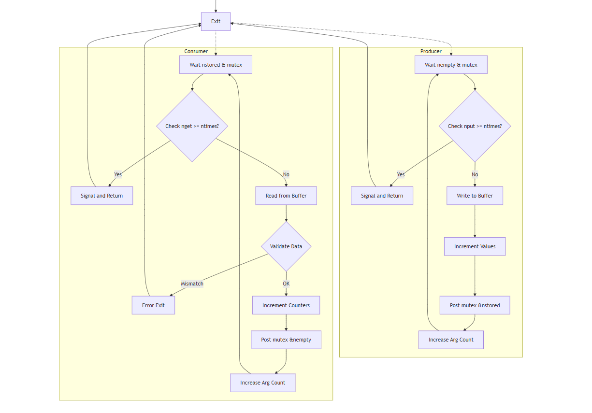

# 第十章 posxi信号量

## 10.1 概述

> 信号量是一种用于提供不同进程或 一个进程内部线程间同步手段的原语；
原语就是操作系统中不可打断的原子操作，即要么完全执行，要么不执行。

本书讨论三种类型的信号量；
- posix有名信号量，使用ipc名字标识，可以用于进程和线程同步
- posix基于内存的信号量，存放在共享内存中，用于进程和线程同步
- systemv信号量，在内核 中维护，可以用于进程和线程同步

我们暂时只考虑不同进程间的同步。一个进程可以在某个信号量上执行的三种操作：
<ol>
<li>创建，对于二值信号量来说，不是1就是0
<li>等待，也叫P操作，wait,上锁，递减，如果信号量值为0，则进程阻塞，等待信号量的值变为1它就减1
<li>挂出，也叫V操作，signal,解锁，递增，如果信号量的值为0，则将它设置为1，如果有进程在等待该信号量，则唤醒其中一个进程。
</ol>

`注意信号量可以是二值的，也可以是计数的；本质上无区分；`
这里简单讨论时，把信号量初始化为1，sem_wait调用等待值大于0然后递减。sem_post将它加1 ， 唤醒阻塞在Sem_wait调用中的线程。

## 10.2 现在讨论**生产者-消费者**问题

假设缓冲区是1 
**信号量put 控制 生产者是否可以往共享缓冲区中放一个产品；**
**信号量get 控制 消费者是否可以从共享缓冲区中取一个产品；**
<ol>
<li> 生产者初始化缓冲区和2个信号量
<li> 假设消费者运行，它阻塞在sem_wait调用中，因为get到的值是0
<li> 一段时间后生产者调用sem_wait后，put值1减到0，
于是生产者往缓冲区放一个产品，然后调用sem_post把get的值由0增到1。
既然有一个消费线程阻塞在该信号量上，于是它被唤醒，开始消费。
但是假设生产者继续运行，会随后 阻塞在sem_wait中，因为put的值为0。
生产者必须等待消费者腾空缓冲区。
<li> 消费者从sem_wait中返回，将get信号由1递减为0，然后从缓冲区取走产品，
调用sem_post将put信号由0增到1，于是生产者可以继续运行。
<li> 生产者从sem_wait中返回，将put信号由1递减为0，然后往缓冲区放一个产品，
</ol>

信号量，互斥锁，信号量的三个差异：
1. 互斥锁必须由给它上锁的线程解锁，信号量可以由任意线程解锁。
2. 互斥锁要么被锁住，要么解锁，信号量可以是任意值。
3. 信号量挂出时，如果滑线程等待这个信号量，信号将丢失。


本章中先讲posix有名信号量，然后是基于内存信号量，最后是systemv信号量。

posix有名信号量的三种实现：
- 第一种 fifo
- 第二种 内存映射 io，以及互斥锁和条件变量
- 第三种是system v 信号量；

必须掌握的信号量操作：
sem_open, sem_unlink, sem_trywait, sem_wait, sem_post, setm_getvalue, sem_destroy

> 7.3节我们实现过生产者消费者问题；第一个方案中，消费者是在生产完了再启动的，使用单个互斥锁就能解决问题；第二个方案中，消费者在生产前启动，因此需要使用互斥锁（同步各个生产者）+条件变量+互斥锁（同步生产者和消费者）

下面将对生产者消费者问题扩展，把共享缓冲区作为一个环绕缓冲区。这么一来又增加了一个同步问题，既生产者不能走到消费者前面。
- 缓冲区为空时，消费者不能从缓冲区中拿走一个产品
- 缓冲区满时，生产者不能从中放一个产品
- 共享变量可以描述缓冲区当前的状态（下标，计数和链表指针），因此生产者和消费者的所有缓冲区操作都必须保护起来。

信号量方案使用了三种不同类型的信号量：
- 名为mutex 的二值信号量保护2个临界区：一个是往共享缓冲区中放产品的临界区，一个是从共享缓冲区中取产品的临界区。显然这里可以用真正的互斥锁代替。
- 名为empty 的计数信号量，表示缓冲区中空槽的数量。初始化为缓冲区大小。
- 名为store 的计数信号量，表示缓冲区中产品的数量。初始化为0

## 10.3 死锁：
如何已经发生了死锁，要如何定位 ？
```c
void producer(void *arg)
#if SHOW_DEADLOCK    
72:        sem_wait(shared.mutex); //P 操作，减1
        sem_wait(shared.empty_slots);// P 操作，减1
#else
        //应该先确保有空间，再进入临界区
        sem_wait(shared.empty_slots);
        sem_wait(shared.mutex);
#endif 
void consumer(void *arg)
#if SHOW_DEADLOCK
91:        sem_wait(shared.mutex);
        sem_wait(shared.filled_slots);
#else
        //应该先确保有数据，再进入临界区
        sem_wait(shared.filled_slots);
        sem_wait(shared.mutex);
#endif   

```

### 方法一：使用gdb 工具
```shell
ps aux |grep pv01 
gdb -p 347247
thread apply all bt

(gdb) thread a all bt

Thread 3 (Thread 0x7f7d7ebcd6c0 (LWP 347249) "pv01"):
#0  __futex_abstimed_wait_common64 (private=<optimized out>, cancel=true, abstime=0x0, op=265, expected=0, futex_word=0x7f7d7f5c2000) at ./nptl/futex-internal.c:57
#1  __futex_abstimed_wait_common (futex_word=futex_word@entry=0x7f7d7f5c2000, expected=expected@entry=0, clockid=clockid@entry=0, abstime=abstime@entry=0x0, private=<optimized out>, cancel=cancel@entry=true) at ./nptl/futex-internal.c:87
#2  0x00007f7d7f457f7b in __GI___futex_abstimed_wait_cancelable64 (futex_word=futex_word@entry=0x7f7d7f5c2000, expected=expected@entry=0, clockid=clockid@entry=0, abstime=abstime@entry=0x0, private=<optimized out>) at ./nptl/futex-internal.c:139
#3  0x00007f7d7f462ccf in do_futex_wait (sem=sem@entry=0x7f7d7f5c2000, abstime=0x0, clockid=0) at ./nptl/sem_waitcommon.c:111
#4  0x00007f7d7f462d60 in __new_sem_wait_slow64 (sem=0x7f7d7f5c2000, abstime=0x0, clockid=0) at ./nptl/sem_waitcommon.c:183
```
**`consumer 阻塞在sem_wait中`**
```shell
#5  0x00005652062a5584 in consumer (arg=0x0) at /home/vboxuser/09-unix-network/chap10/pv01.c:91
#6  0x00007f7d7f45b1c4 in start_thread (arg=<optimized out>) at ./nptl/pthread_create.c:442
#7  0x00007f7d7f4db85c in clone3 () at ../sysdeps/unix/sysv/linux/x86_64/clone3.S:81

Thread 2 (Thread 0x7f7d7f3ce6c0 (LWP 347248) "pv01"):
#0  __futex_abstimed_wait_common64 (private=<optimized out>, cancel=true, abstime=0x0, op=265, expected=0, futex_word=0x7f7d7f5c4000) at ./nptl/futex-internal.c:57
#1  __futex_abstimed_wait_common (futex_word=futex_word@entry=0x7f7d7f5c4000, expected=expected@entry=0, clockid=clockid@entry=0, abstime=abstime@entry=0x0, private=<optimized out>, cancel=cancel@entry=true) at ./nptl/futex-internal.c:87
#2  0x00007f7d7f457f7b in __GI___futex_abstimed_wait_cancelable64 (futex_word=futex_word@entry=0x7f7d7f5c4000, expected=expected@entry=0, clockid=clockid@entry=0, abstime=abstime@entry=0x0, private=<optimized out>) at ./nptl/futex-internal.c:139
#3  0x00007f7d7f462ccf in do_futex_wait (sem=sem@entry=0x7f7d7f5c4000, abstime=0x0, clockid=0) at ./nptl/sem_waitcommon.c:111
#4  0x00007f7d7f462d60 in __new_sem_wait_slow64 (sem=0x7f7d7f5c4000, abstime=0x0, clockid=0) at ./nptl/sem_waitcommon.c:183
```
**`producer 阻塞在sem_wait中`**
```shell
#5  0x00005652062a5496 in producer (arg=0x0) at /home/vboxuser/09-unix-network/chap10/pv01.c:72
#6  0x00007f7d7f45b1c4 in start_thread (arg=<optimized out>) at ./nptl/pthread_create.c:442
#7  0x00007f7d7f4db85c in clone3 () at ../sysdeps/unix/sysv/linux/x86_64/clone3.S:81

```


### 方法二：使用strace工具（结合上面的gdb?)

​**futex 系统调用**：表明线程在等待锁或信号量。

```shell
vboxuser@debian12:~$ strace -p 347247
strace: Process 347247 attached
futex(0x7f7d7f3ce990, FUTEX_WAIT_BITSET|FUTEX_CLOCK_REALTIME, 347248, NULL, FUTEX_BITSET_MATCH_ANY


(gdb) p shared.mutex
$1 = (sem_t *) 0x7f7d7f5c2000
(gdb) p shared.empty_slots
$2 = (sem_t *) 0x7f7d7f5c4000
```
​地址分析：
0x7f7d7f5c2000 和 0x7f7d7f5c4000 对应不同的信号量。
结合代码可知，生产者等待 empty_slots，消费者等待 filled_slots

```shell
vboxuser@debian12:~/09-unix-network/chap10$ strace -f ./pv01 10
execve("./pv01", ["./pv01", "10"], 0x7ffd399a4f20 /* 22 vars */) = 0
...
[pid 388296] futex(0x7fd74e1ae000, FUTEX_WAKE, 1) = 1
[pid 388295] <... futex resumed>)       = 0
[pid 388296] futex(0x7fd74e1ac000, FUTEX_WAIT_BITSET|FUTEX_CLOCK_REALTIME, 0, NULL, FUTEX_BITSET_MATCH_ANY <unfinished ...>
[pid 388295] futex(0x7fd74e1ae000, FUTEX_WAIT_BITSET|FUTEX_CLOCK_REALTIME, 0, NULL, FUTEX_BITSET_MATCH_ANY

```
### 方法三：使用Valgrind + Helgrind 重新运行
但是实际使用valgrind 很难出现死锁。why ?
```
为什么 Helgrind 没有报告？
信号量与互斥锁的差异：

Helgrind 主要跟踪 pthread_mutex_t 的锁顺序，但对 sem_t 的支持较弱。

命名信号量（通过 sem_open）可能被 Helgrind 视为系统级资源，无法精确追踪。

死锁类型：

这种死锁是 资源顺序死锁（Resource Ordering Deadlock），而非数据竞争或锁顺序反转（Lock Inversion），Helgrind 难以检测
```

### 方法四：使用 ltrace 跟踪库函数重新运行
```shell

vboxuser@debian12:~/09-unix-network/chap10$ ltrace -f  ./pv01 100

[pid 410302] sem_open(0x55aed936e045, 192, 384, 1)                                               = 0x7fdee7704000
[pid 410302] sem_open(0x55aed936e05c, 192, 384, 10)                                              = 0x7fdee7703000
[pid 410302] sem_open(0x55aed936e07f, 192, 384, 0)                                               = 0x7fdee7702000
 
```
 生产者获取 mutex 成功（地址 0x7fdee7704000）
```shell
[pid 410304] sem_wait(0x7fdee7704000, 0x7fdee6d0dfb0, 0, 0x7fdee759b006)                         = 0
```
 消费者尝试获取 mutex（阻塞）
```shell
[pid 410303] sem_wait(0x7fdee7704000, 0x7fdee750efb0, 0, 0x7fdee759b006 <unfinished ...>
```
 生产者尝试获取 filled_slots（阻塞？）
```shell
[pid 410304] sem_wait(0x7fdee7702000, 0x7fdee6d0dfb0, 0, 0x7fdee759b006
```
### 方法五：使用 pstack 快速查看堆栈
 Debian/Ubuntu 等基于 apt 的发行版默认不包含 pstack 工具
```shell
root@debian12:/home/vboxuser/Downloads/pstack/pstack/build# ps -eo pid,state,command | grep 419559
 419559 S ./pv01 100
 420622 S grep 419559
root@debian12:/home/vboxuser/Downloads/pstack/pstack/build# cat /proc/419559/status | grep State
State:  S (sleeping)
root@debian12:/home/vboxuser/Downloads/pstack/pstack/build# ls /proc/419559/task/
419559  419560  419561
```
1. 生产者线程（LWP 419559）：
阻塞在 sem_wait(shared.empty_slots)（对应 futex_wait 系统调用）。

但根据你之前的 ltrace 输出，生产者错误地先获取了 mutex，再尝试获取 empty_slots，导致它持有 mutex 并等待 empty_slots。
```shell
root@debian12:/home/vboxuser/Downloads/pstack/pstack/build# cat /proc/419559/stack
[<0>] futex_wait_queue+0x60/0x90
[<0>] futex_wait+0x185/0x270
[<0>] do_futex+0x106/0x1b0
[<0>] __x64_sys_futex+0x8e/0x1d0
[<0>] do_syscall_64+0x55/0xb0
[<0>] entry_SYSCALL_64_after_hwframe+0x6e/0xd8
```
2. 消费者线程（LWP 419560）：
阻塞在 sem_wait(shared.mutex)，因为它需要 mutex 才能继续执行，但 mutex 被生产者持有。
```shell
root@debian12:/home/vboxuser/Downloads/pstack/pstack/build# cat /proc/419559/task/419560/stack
[<0>] futex_wait_queue+0x60/0x90
[<0>] futex_wait+0x185/0x270
[<0>] do_futex+0x106/0x1b0
[<0>] __x64_sys_futex+0x8e/0x1d0
[<0>] do_syscall_64+0x55/0xb0
[<0>] entry_SYSCALL_64_after_hwframe+0x6e/0xd8
```
 死锁链条：
生产者：持有 mutex → 等待 empty_slots。

消费者：等待 mutex → 无法释放 filled_slots。

由于 empty_slots 和 filled_slots 是同步信号量，双方互相等待对方释放资源，形成死锁

```shell
vboxuser@debian12:~/09-unix-network/chap10$ strace -f -e trace=futex ./pv01 10
s
[pid 424811] futex(0x7fa298ebc990, FUTEX_WAIT_BITSET|FUTEX_CLOCK_REALTIME, 424812, NULL, FUTEX_BITSET_MATCH_ANY <unfinished ...>
[pid 424813] futex(0x7fa2990b2000, FUTEX_WAIT_BITSET|FUTEX_CLOCK_REALTIME, 0, NULL, FUTEX_BITSET_MATCH_ANY[424812] Produced: 0
 <unfinished ...>
[pid 424812] futex(0x7fa2990b2000, FUTEX_WAKE, 1 <unfinished ...>
[pid 424813] <... futex resumed>)       = 0
[pid 424812] <... futex resumed>)       = 1
[pid 424813] futex(0x7fa2990b0000, FUTEX_WAIT_BITSET|FUTEX_CLOCK_REALTIME, 0, NULL, FUTEX_BITSET_MATCH_ANY) = -1 EAGAIN (Resource temporarily unavailable)
[pid 424812] futex(0x7fa2990b0000, FUTEX_WAKE, 1) = 0
[pid 424812] futex(0x7fa2990b2000, FUTEX_WAIT_BITSET|FUTEX_CLOCK_REALTIME, 0, NULL, FUTEX_BITSET_MATCH_ANY[424813]                Consumed: 0
 <unfinished ...>
[pid 424813] futex(0x7fa2990b2000, FUTEX_WAKE, 1) = 1
[pid 424812] <... futex resumed>)       = 0
[pid 424813] futex(0x7fa2990b0000, FUTEX_WAIT_BITSET|FUTEX_CLOCK_REALTIME, 0, NULL, FUTEX_BITSET_MATCH_ANY <unfinished ...>
[pid 424812] futex(0x7fa2990b2000, FUTEX_WAIT_BITSET|FUTEX_CLOCK_REALTIME, 0, NULL, FUTEX_BITSET_MATCH_ANY

```

### 方法六：查看信号量状态
`查看所有信号量`

ipcs -s

`查看信号量详细信息`

ipcs -s -i <sem_id>

代码使用的是 POSIX 命名信号量（通过 sem_open 创建），而 ipcs -s 只能查看 System V 信号量。


---
一、futex 系统调用的基本概念
futex（Fast Userspace Mutex）是 Linux 内核提供的一种 用户态和内核态混合的同步机制，广泛用于实现线程同步原语（如互斥锁、信号量）。它的核心思想是：

用户态快速路径：在没有竞争的情况下，完全在用户态完成操作（无需进入内核态）。

内核态慢速路径：在需要等待或唤醒时，通过系统调用进入内核态。
1. FUTEX_WAIT
功能：让当前线程进入等待状态，直到另一个线程通过 FUTEX_WAKE 唤醒它。
2. FUTEX_WAKE
功能：唤醒一个或多个在 uaddr 地址上等待的线程
3. 分析方法：
FUTEX_WAIT：线程主动进入等待状态，直到被唤醒。

FUTEX_WAKE：唤醒等待的线程，解除阻塞。

死锁分析：通过观察线程是否永久阻塞在 FUTEX_WAIT 且无对应 FUTEX_WAKE，结合代码逻辑定位资源竞争问题。

vboxuser@debian12:~$ cat /proc/424811/maps|grep  7fa2990b0000
7fa2990b0000-7fa2990b1000 rw-s 00000000 00:18 550                        /dev/shm/sem.0OoWhD (deleted)
vboxuser@debian12:~$ cat /proc/424811/maps|grep  7fa2990b0000
7fa2990b0000-7fa2990b1000 rw-s 00000000 00:18 550                        /dev/shm/sem.0OoWhD (deleted)

## 10.3 基于内存的信号量
>本章前面介绍的是基于posix 有名信号量，这里介绍基于内存的信号量。
由应用程序分配内存信号的空间，也就是一个sem_t数据类型的内存空间，系统初始化它们的值。
- sem_init() 初始化信号量
- sem_destroy() 销毁信号量
基于内存的信号量不使用 O_CREATE标志的东西，因此对于一个给定的信号量，必须小心只调用sem_init一次。
你得理解sem_open和sem_init的基本差异：
- sem_open 返回一个指向某个sem_t的指针，这个sem_t是内核中的一个有名信号量。
- sem_init 指向某个sem_t的指针，该变量由调用者分配由sem_init初始化。
当不需要使用与有名信号量关联的名字时，可以改用基于内存的信号量。
彼此无亲缘关系的不同进程通常使用有名信号量。
基于内存的信号量至少具有随进程的生命周期。如果是基于不同进程共享的，该信号量必须放在共享内存。

## 10.4 多个生产者，单个消费者
正确的信号量获取顺序
- 生产者 生产者先获取空槽信号量 nempty，确保缓冲区有空位，再获取互斥锁 mutex 进行生产。
sem_wait(&shared.nempty);
sem_wait(&shared.mutex);
- 消费者 消费者先获取存储信号量 nstored，确保缓冲区有数据，再获取互斥锁 mutex 进行消费。
sem_wait(&shared.nstored);
sem_wait(&shared.mutex);

在解决生产者-消费者问题时，信号量的获取和释放顺序都是至关重要的。除了先申请资源（如空槽 nempty 或存储 nstored）再申请互斥锁 mutex 这一点外，释放的顺序同样重要。
<ol>
<li>生产者在更新缓冲区并增加存储计数后，先释放互斥锁，使其他线程可以访问缓冲区，然后释放存储信号量，通知消费者有新数据。
<li>消费者在消费数据并减少存储计数后，先释放互斥锁，使其他线程可以访问缓冲区，然后释放空槽信号量，通知生产者有空槽可用
</ol>

```c
//生产者
em_post(&shared.mutex);       // 先释放互斥锁
sem_post(&shared.nstored);     // 再释放存储信号量，通知消费者有新数据可消费

//消费者
sem_post(&shared.mutex);       // 先释放互斥锁
sem_post(&shared.nempty);      // 再释放空槽信号量，通知生产者有空槽可用
```

## 10.5 多个生产者，多个消费者

## 10.6 多个缓冲区
为什么？
双缓冲方案所花时间几乎是单缓冲的一半；
三缓冲方案所花时间几乎是单缓冲的1/3；

双缓冲工作原理
双缓冲有两个缓冲区。生产者在一个缓冲区写入数据时，消费者可以从另一个缓冲区读取数据，两者可以并行工作。当生产者完成一个缓冲区的写入后，切换到另一个缓冲区继续写入，同时消费者也切换到新写入数据的缓冲区进行读取。

当 (T_p) 和 (T_c) 相差不大时，在双缓冲机制下，处理一个数据块的时间约为 (\max(T_p, T_c))。如果 (T_p \approx T_c)，那么处理一个数据块的总时间 (T_{double}) 约为： (T_{double} \approx T_p \approx T_c)

因为 (T_{single} = T_p + T_c) 且 (T_p \approx T_c)，所以 (T_{double} \approx \frac{1}{2}T_{single})，即双缓冲所用时间约为单缓冲的一半。

在代码中，当 NBUFF 增大时，生产者和消费者能在不同的缓冲区并行操作，减少了彼此等待的时间。例如，当 NBUFF 为 2 时，生产者在一个缓冲区写入数据，消费者可以同时从另一个缓冲区读取数据；当 NBUFF 为 3 时，并发度更高，能更充分地利用生产者和消费者的处理能力，从而减少整体处理时间。

## 10.7 进程间共享信号量
进程间共享信号量比较简单：信号量本身，其地址作为sem_init 第一个参数的sem_t变量，在共享内存中。
并且，sem_init第2个参数必须为1；
这些规则 与进程间共享互斥锁，条件变量或读写锁的规则类似。

## 10.8 信号量限制
信号量限制
- SEM_VALUE_MAX：信号量的最大值，通常是 INT_MAX  32767。
- SEM_NSEMS_MAX：单个进程可以创建的最大有名信号量数，通常是 256 或更多。
    long nsems_max = sysconf(_SC_SEM_NSEMS_MAX);
    long value_max = sysconf(_SC_SEM_VALUE_MAX);
    //SEM_NSEMS_MAX = -1, SEM_VALUE_MAX = 2147483647

## 10.9 信号量与互斥锁的比较
信号量和互斥锁都可以用于线程同步，但它们在用途和实现上有一些关键区别：

### 用途差异
- **互斥锁**主要用于保护临界区，确保同一时刻只有一个线程（或进程）能访问该区域。它防止多个线程同时修改共享资源，从而避免数据竞争和不一致性。
- **信号量**则适用于更广泛的场景，如控制对资源的并发访问数量、实现生产者-消费者模型中的协调等。它可以允许多个线程等待直到某个条件满足（例如缓冲区中有空位），而不仅仅是单一资源的独占使用。

### 实现机制
- **互斥锁**通常基于自旋锁或睡眠/唤醒机制来实现，以确保当一个线程持有锁时其他尝试获取的线程会阻塞并等待释放。
- **信号量**的实现可能涉及计数器和一个或多个等待队列。当信号量的计数值

### 类型
- **互斥锁**通常是二值（0或1），表示锁的占用状态。pthread_mutex_t 类型的变量。
- **信号量**可以是多值的，表示可用资源的数量。sem_t 类型的变量。

## 10.10 使用FIFO 实现信号量
posix有名信号量；

## 10.11 使用内存映射 实现信号量

## 10.12 使用System V信号量模拟 posix信号量


